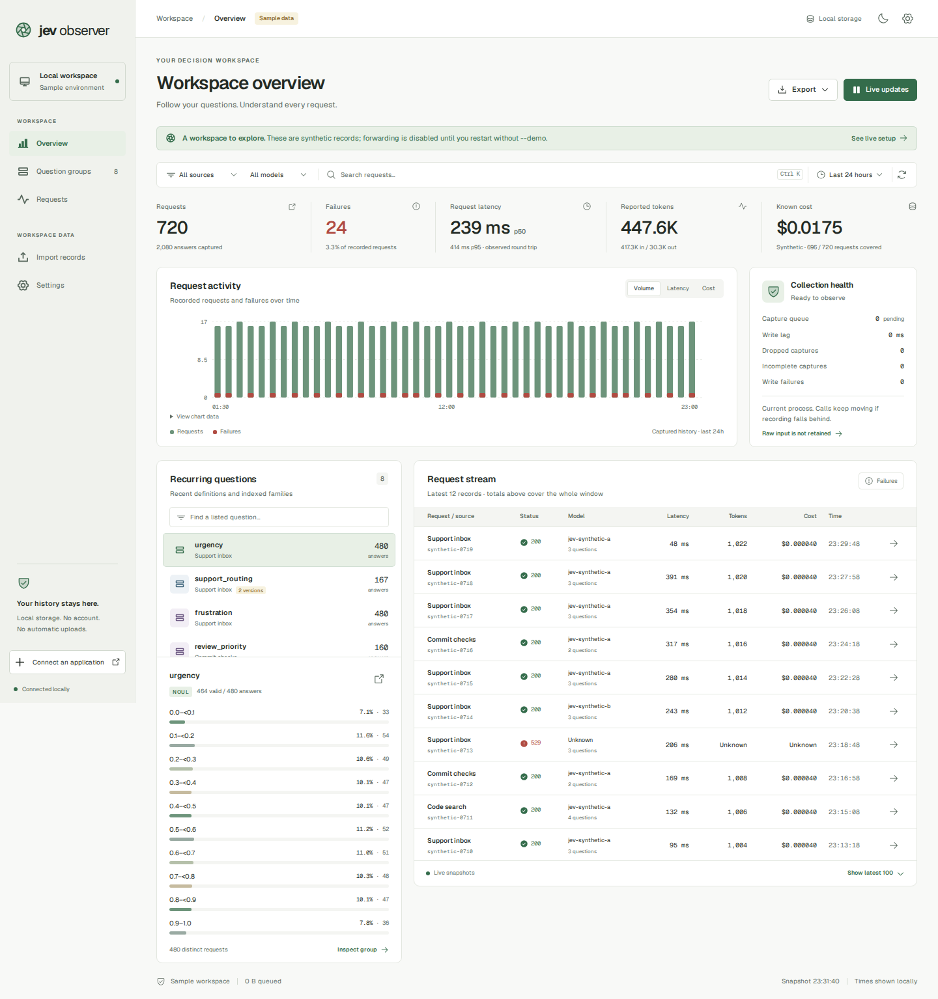
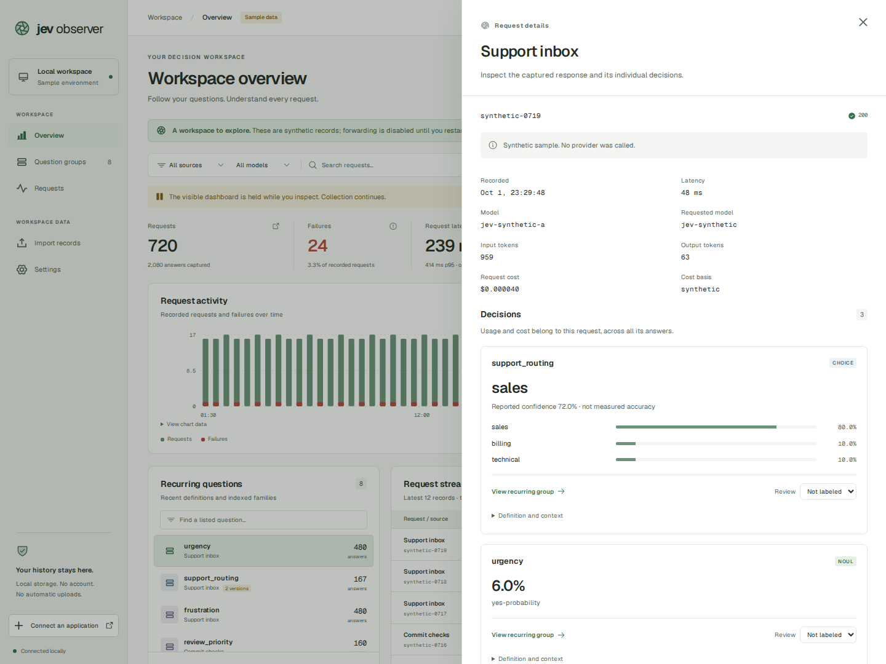

**See what Jev decided—and how its answers change when your questions do.**

# Jev Observer

[English](README.md) · [한국어](README.ko.md) · [Website & product tour](https://jev-observer-web.vercel.app/)

Jev Observer is a local proxy and dashboard for **Jev and compatible System One models**, including local Laya servers. It saves requests and answers so you can inspect decisions, compare question definitions, and track failures, latency, token usage and cost.

Your application sends requests through Observer to your configured model provider. You review the saved history in a browser:

```text
Application → Jev Observer → Model provider or local Laya server
                   ↓
          Local history + dashboard
```

Built with Rust, SQLite and React, Observer runs as **one executable** with its dashboard and fonts included. It needs no Observer account or subscription and sends no analytics or automatic event uploads. Live inference still goes to your configured provider and is subject to its charges.



*The dashboard in offline demo mode: 720 synthetic requests with sample latency, usage and costs.*

<details>
<summary>See request details and answer probabilities</summary>



Inspect answers, probabilities and request usage, then add a local review label. This example uses synthetic data.

</details>

## What you can do

- **Inspect decisions:** view Choice, Score and Noul answers, their definitions and reported probabilities.
- **Compare question versions:** group recurring questions and keep statistics separate when their definitions change.
- **Find and review results:** search question groups, filter history by date, source or model, and label answers correct, incorrect or unknown.
- **Track usage and cost:** see request-level token usage, OpenRouter-reported USD cost or your configured estimates. Each request is counted once, even if it contains several answers.
- **Move your data:** import Observer JSONL or supported JevRouter receipts; export filtered history as JSONL or CSV.
- **Try it offline:** explore the demo without provider credentials or model calls.

Observer currently forwards `POST /v1/systemone`. It does not host models, provide universal provider routing, or replay the same inputs across question versions. See [compatibility and tested scope](docs/compatibility.md).

## Quick start: try the demo

[Download v0.2.0](https://github.com/LimePencil/jev-observer/releases/tag/v0.2.0), or use an installer below. Prebuilt releases need no Rust, Node.js, database server or administrator access.

| Platform | Architectures | Archive |
|---|---|---|
| Linux | x86-64 / ARM64 | `.tar.gz` (static musl executable) |
| macOS | Intel / Apple silicon | `.tar.gz` |
| Windows | x86-64 / ARM64 | `.zip` |

### Linux / macOS

```sh
curl -fsSL https://raw.githubusercontent.com/LimePencil/jev-observer/main/install.sh -o install.sh
sh install.sh --version 0.2.0
export PATH="$HOME/.local/bin:$PATH"
jev-observer --demo
```

### Windows PowerShell

```powershell
Invoke-WebRequest https://raw.githubusercontent.com/LimePencil/jev-observer/main/install.ps1 -OutFile install.ps1
.\install.ps1 -Version 0.2.0
$env:PATH = "$env:LOCALAPPDATA\JevObserver\bin;$env:PATH"
jev-observer --demo
```

Open **[http://127.0.0.1:8765](http://127.0.0.1:8765)** and sign in:

| Field | Value |
|---|---|
| Username | `observer` |
| Password | The token in `.jev-observer/observer.demo.access-token` |

Observer prints the exact token-file path at startup. Demo mode uses a separate `*.demo.sqlite` database, disables forwarding and works offline. Press **Ctrl-C** to stop it.

macOS and Windows executables are unsigned. For OS restrictions, private repository access, upgrades or uninstalling, see the [installation guide](docs/installation.md). Every release includes `SHA256SUMS`; see the [0.2.0 release notes](docs/releases/0.2.0.md) for changes.

## Connect an application

### 1. Create and save a database key

Live history is encrypted. Generate a **32-byte key**, save the printed 64-character value in a password manager, and supply it as `JEV_OBSERVER_DB_KEY` on every live startup. **Losing this key makes your encrypted history unreadable.** It is separate from your provider key and dashboard login token.

Bash (requires OpenSSL):

```bash
# Generate once and save the printed value.
openssl rand -hex 32

# Read your saved key without displaying it or putting it in shell history.
read -r -s -p 'Saved database key: ' JEV_OBSERVER_DB_KEY; echo
export JEV_OBSERVER_DB_KEY
```

<details>
<summary>Windows PowerShell equivalent</summary>

```powershell
# Generate once and save the printed value.
$keyBytes = New-Object byte[] 32
$random = [Security.Cryptography.RandomNumberGenerator]::Create()
$random.GetBytes($keyBytes)
$random.Dispose()
[BitConverter]::ToString($keyBytes).Replace('-', '').ToLowerInvariant()

# Read your saved key without displaying it.
$savedKey = Read-Host 'Saved database key' -AsSecureString
$env:JEV_OBSERVER_DB_KEY = [Net.NetworkCredential]::new('', $savedKey).Password
```

</details>

### 2. Start Observer and register your provider key

Run from your application's directory, or use `--db /path/to/observer.sqlite` to choose a stable history location:

```sh
jev-observer
```

The default upstream is `https://api.typesafe.ai/v1/systemone`. To use Jev through OpenRouter, start with:

```sh
jev-observer --upstream https://openrouter.ai/api/v1/systemone
```

Open the dashboard and sign in as `observer` using the token in `.jev-observer/observer.access-token` (the live token file).

In **Connect an application**, enter your provider key and choose session-only storage or your operating system's credential store. Copy the **local client token** shown once and set it as `JEV_OBSERVER_CLIENT_TOKEN` in your application's environment. Session-only keys need registration again after Observer restarts.

### 3. Point your SDK at Observer

Use the local origin **`http://127.0.0.1:8765`** as the base URL. The tested SDKs append `/v1/systemone` themselves. Keep your existing inference calls and use the local client token as the SDK key.

**Python** — tested with `typesafe-sdk==0.7.1`:

```python
import os
from typesafe_sdk import TypeSafeClient

client = TypeSafeClient(
    api_key=os.environ["JEV_OBSERVER_CLIENT_TOKEN"],
    base_url="http://127.0.0.1:8765",
    headers={
        "x-observer-source": "my-application",
        "Accept-Encoding": "identity",
    },
)
```

**JavaScript** — tested with `@typesafe-ai/sdk@0.6.0`:

```javascript
import { TypeSafeClient } from "@typesafe-ai/sdk";

const client = new TypeSafeClient({
  apiKey: process.env.JEV_OBSERVER_CLIENT_TOKEN,
  baseURL: "http://127.0.0.1:8765",
  defaultHeaders: {
    "x-observer-source": "my-application",
    "Accept-Encoding": "identity",
  },
});
```

Observer checks the local client token and substitutes your registered provider key before forwarding. `x-observer-source` identifies your application in history. `Accept-Encoding: identity` allows typed-answer capture; compressed responses pass through, but their saved captures are marked incomplete.

The [connection guide](docs/connection.md) covers direct provider-key authentication, additional metadata and credential handling. The [compatibility guide](docs/compatibility.md) records SDK mock checks and separate real-inference checks for OpenRouter and Laya.

### Use a local Laya server

With Laya already running on loopback without a provider key, and your saved database key set:

```sh
jev-observer --upstream http://127.0.0.1:8000/v1/systemone \
  --upstream-auth none --provider laya
```

Use the workspace token from `.jev-observer/observer.access-token` as the SDK key and `english` as the request model. Observer authenticates your application locally and sends no authorization to Laya. CPU inference may need a longer SDK timeout. See [local-model setup](docs/connection.md#laya-and-other-local-system-one-models) for starting Laya, key-protected servers and compatibility limits.

## Storage and privacy

| Setting | Default |
|---|---|
| Dashboard and proxy | `127.0.0.1:8765` |
| Live history | `.jev-observer/observer.sqlite`, relative to the startup directory |
| Retention | 7 days, with a soft cap of 1,000,000 records |
| Raw input-state storage | Off; enable with `--capture-state` |

Live history uses SQLCipher encryption. Known credentials are redacted, but saved question definitions and answers may still contain sensitive content. **Demo databases and JSONL/CSV exports are plaintext.** Stop older Observer processes before migrating an existing plaintext database.

Unknown usage and cost stay unknown. OpenRouter-reported USD cost takes precedence over estimates. To enable your own estimates, supply both `--input-price-per-million` and `--output-price-per-million` in USD; they are not invoices or automatically updated prices.

Collection health reports recording failures and capture or queue limits that can leave gaps in history. Abrupt termination can lose observations, and requests cannot pass through a stopped Observer. See [storage, privacy and operating limits](docs/storage.md) for backups, redaction, import limits and shutdown behavior.

## Build and develop

Use the Rust toolchain pinned in [rust-toolchain.toml](rust-toolchain.toml), a native C compiler, and Node.js **22.12 or later** with npm. Windows also needs Visual Studio C++ Build Tools, native Windows Perl (such as Strawberry Perl) and NASM for bundled OpenSSL.

Build the dashboard **before** Rust so its assets are embedded:

```sh
npm ci --prefix ui
npm run build --prefix ui
cargo build --release --locked
./target/release/jev-observer --demo
```

On Windows, run `.\target\release\jev-observer.exe --demo`. If Git Bash Perl is on `PATH`, set `$env:OPENSSL_SRC_PERL` to your native Perl executable before building. Node.js is only needed for development and builds.

After installing dependencies and building the UI, run the checks:

```sh
cargo fmt --all --check
cargo clippy --locked --all-targets -- -D warnings
cargo test --locked
python3 scripts/test-install.py
npx --prefix ui playwright install chromium
npm test --prefix ui
OBSERVER_BINARY="$PWD/target/release/jev-observer" npm run test:integration --prefix ui
```

The last command uses Bash and exercises the embedded dashboard against the real local backend without provider calls. For frontend development, run the backend on port 8765 and `npm run dev --prefix ui`. See [UI development notes](ui/README.md) and the [CI workflow](.github/workflows/ci.yml).

## Documentation

- [Installation, upgrades and troubleshooting](docs/installation.md)
- [Application connection and credentials](docs/connection.md)
- [SDK and provider compatibility](docs/compatibility.md)
- [Storage, privacy and operating limits](docs/storage.md)
- [Performance measurements](docs/performance.md) and [stress testing](docs/stress.md)
- [Implementation contract](docs/implementation-contract.md)

For project history, see the [research and launch plan](research/launch.md), [survey](research/survey/README.md), [source register](research/sources.md), [historical reports](reports/README.md) and [validation evidence](reports/validation/README.md). Planning documents include proposed work; they do not describe only shipped features.

## License

Jev Observer is an independent project with a provisional name. Its own code is [MIT-licensed](LICENSE); bundled components and fonts retain their respective licenses. Releases embed the notices at `/licenses/jev-observer-MIT.txt` and `/licenses/THIRD-PARTY-NOTICES.txt`. See [license maintenance](docs/licensing.md).
