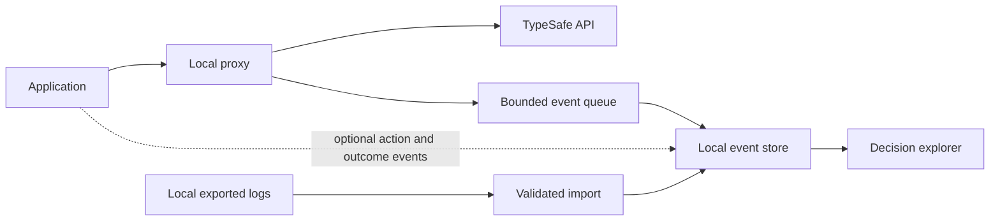

# Proposed MVP and feasibility

Status: design proposal, not implemented or integration-tested. The product is free, local, and MIT-licensed. All planned features belong in the same open-source application.

The [100-project survey](survey/README.md) changes the priorities: support local log import early, retain application-action provenance, and build one indexed-question adapter before claiming automatic grouping works across Jev projects. Existing dashboards and incompatible provider transports make a universal proxy-only pitch too broad.

## What can be integrated

The official API accepts `POST /v1/systemone` with `state`, `model`, and a `questions` map. Responses contain typed answers keyed to those questions and aggregate token usage. Store one request with child answer records. [API reference](https://docs.typesafe.ai/api)

The Python SDK documents `base_url` and the `TYPESAFE_BASE_URL` environment variable. That supports a low-friction local proxy experiment, though actual compatibility still needs testing with pinned SDK versions. [Python client](https://docs.typesafe.ai/sdk/python/api/clients/sync)

Vercel documents the JavaScript SDK's `baseURL` option and a compatible `/typesafe/v1/systemone` endpoint. Its documented response includes gateway cost metadata. This is a possible second upstream, not implemented support. Preserve provider-specific fields and distinguish provider-reported cost from estimates. [Vercel TypeSafe API](https://vercel.com/docs/ai-gateway/sdks-and-apis/typesafe)

Start with direct TypeSafe HTTP and its Python/JavaScript clients. Other gateways, native evaluation APIs, and framework wrappers require separate compatibility checks. Do not advertise support merely because they also use Jev.

Begin compatibility fixtures with zod-jev or jev-commit, then a self-hosted n8n workflow and one indexed row-filtering example. These are survey-based candidates, not tested integrations or partner commitments. Hosted Apps Script, cloud workers and provider bindings cannot automatically reach a desktop loopback proxy; support imported local records or a reachable locally run application instead. Do not expose a public collector to make a local-first demo work.

## Collection design

Proposed first implementation: a small Rust service with an embedded browser UI and SQLite, packaged as one local executable. This is an implementation choice to keep local installation and operations simple, not a performance claim. Choose and verify specific libraries when implementation begins.

Use a configured upstream allowlist, not arbitrary destination URLs. Bind the initial collector to loopback. Keep credentials out of stored events and browser responses. Store history in a user-controlled local database. Bundle UI assets locally, require no project account, and send no analytics or automatic event uploads. Live inference goes only to the configured provider; sample mode and history inspection work offline.

Persist telemetry outside the forwarding critical path using a bounded queue. If collection fails, expose missing-event counters and timestamps while forwarding according to the documented proxy behavior. This only tolerates telemetry failures: if the proxy process is unavailable, calls cannot pass through it. Later asynchronous SDK ingestion is an alternative for users who cannot accept that dependency.

Return upstream statuses and bodies without rewriting decisions. SDKs already retry by default; avoid adding an invisible second retry layer. Record individual attempts and only group them into a logical call when an explicit correlation identifier is present. [SDK behavior](https://docs.typesafe.ai/sdk)

## First useful slice

1. Native pass-through and a visible collector health indicator.
2. Request list: timestamp, project/session, status, latency, tokens, cost basis, question count.
3. Per-question details: type, selected value, options/levels, probabilities, confidence where present.
4. Automatic groups and charts for recurring Jev question definitions, with version-aware filters. Include task-version context and preserve presentation differences. See [automatic question grouping](grouping.md).
5. Local JSONL import and JSON/CSV export, plus a synthetic sample mode that needs no provider key. Preserve source event IDs and provenance; do not deduplicate merely identical payloads.
6. One tested indexed-family adapter for a reviewed row-filtering or compaction request builder. Preserve strict definitions and explain which instance references are normalized. Unknown patterns remain separate with optional family suggestions.

Build basic manual correct/incorrect/unknown labels and same-dataset comparison next, as free local features. Billing, hosted accounts, paid tiers, and a universal model router are outside the project scope.

## Proposed event model

These are our proposed telemetry fields, not additional fields to inject into TypeSafe's API body.

| Record | Proposed fields |
|---|---|
| Request | Local ID, optional logical-call/session ID, project, environment, timestamps, provider, requested model, returned model, status, input/output usage, reported or estimated cost, rate version |
| Answer | Request ID, original question key, type, definition and presentation fingerprints, optional task version, selected value, probabilities, optional confidence, candidate-set fingerprint, optional retained criteria/legend |
| Question family | Source, family ID, adapter and grouping versions, instance reference, mapping reason, linked original definitions |
| Import provenance | Source file/format, explicit source event ID when available, import ID, event kind, original timestamp |
| Application action | Request/answer ID, policy version, threshold/rule, action attempted, execution result, timestamp |
| Outcome | Linked decision, label/value, label source, reviewer or process, timestamp, revision |
| Collection health | Queue depth, dropped events, write failures, last success, payload truncation/redaction indicators |

Question keys alone are insufficient for grouping. Fingerprint the full definition and preserve presentation order as a separate version. Exclude changing input examples and answers from definition identity, but allow task-version metadata for rules or taxonomies carried in state. Automatically create definition-based groups within a source namespace; semantic task equivalence is not guaranteed without context. Keep model/policy versions available as separate slices. See the [grouping specification](grouping.md) for exact matches, indexed families and accounting boundaries. If option semantics change, require an explicit mapping before aggregating labels.

Use proxy-only headers or a separate ingestion endpoint for metadata; strip proxy headers before upstream forwarding. Question labels can also contain sensitive content, so redaction must cover more than the `state` field.

## What the proxy cannot infer

| Available from intercepted calls | Requires application data or labels |
|---|---|
| Question definitions and model answers | Which selected action actually ran |
| HTTP errors and observed latency | Whether a retry reached the provider before a timeout |
| Returned usage and some providers' cost metadata | Correctness, business impact, reviewer corrections |
| Requested and returned model identifiers | The application's threshold and policy version |
| Probability distribution and available confidence | Causal reasoning behind the model's judgment |

Display missing values as unknown. Never present a successful API response as a successful business outcome. Never generate a plausible explanation and label it as Jev's reasoning.

## Cost, uncertainty, and evaluation rules

The direct API documents token usage, not an invoice amount. Estimate cost with a dated provider/model price record. Preserve missing usage and uncertain timeout billing; an unknown charge is not zero. Keep request cost at the parent record so multiple answers do not multiply the total. [API reference](https://docs.typesafe.ai/api)

Store requested aliases and returned versions. TypeSafe documents that aliases can move and recommends pinning a version when thresholds depend on it. A provider may return only an alias; record it as reported rather than inventing a resolved version. [Model reference](https://docs.typesafe.ai/models)

For Choice, compare probabilities to categorical labels when evaluating calibration. For Noul, compare its yes-probability to boolean labels. Score requires a defined rubric and suitable labels; do not treat a fractional score as an accuracy percentage. Analyze each question/rubric separately. TypeSafe's confidence statistic is a distribution summary, so plots of correctness against confidence need clear labeling rather than a probability-calibration claim. [Confidence documentation](https://docs.typesafe.ai/confidence)

Threshold preview should report labeled sample size, label coverage, automated fraction, review fraction, and errors among automated labeled cases. Include uncertainty intervals when making quantitative claims. User-selected reviewed cases can be biased; validation on a representative held-out set is needed before recommending a threshold.

Repeated live evaluation is a new experiment, not deterministic reproduction. Compare version A and B on identical retained inputs with an explicit run manifest. Redacted or unretained state cannot support exact replay. Distribution shifts without matched inputs remain descriptive signals.

## Retention and trust

Default to no raw-state persistence. Permit explicit local opt-in for redacted snapshots needed for debugging and replay; show when a record cannot be replayed. Configure retention for question definitions, labels, and distributions too. Use opaque IDs and treat hashed content as potentially sensitive, not anonymous.

Keep exports local and user-initiated. Provide retention, deletion, and portable backups without a cloud dependency. Never automatically upload histories, crash reports, or usage analytics. Do not advertise “zero data retention,” “complete audit trail,” or “no latency overhead” without the corresponding implementation and evidence.

## Acceptance criteria for the prototype

- One request containing three questions produces one cost record and three linked answers.
- Raw forwarding preserves successful and error responses; unknown fields survive.
- Changing criteria creates a new definition version; incompatible versions are visibly separated.
- Repeated Jev questions across different input states automatically populate one group without manual per-call labels.
- A known indexed batch produces one family with distinct answer instances; parent request usage and cost are counted once.
- Dynamic candidate IDs never become global labels without a semantic mapping.
- State-carried rule changes are distinguishable when task-version metadata is supplied; otherwise that context is marked unverified.
- Import preserves label/action provenance, treats cached application decisions separately, and does not duplicate an explicit source event ID.
- Choice, Score, and Noul groups get appropriate charts; structurally similar but differently defined questions retain separate statistics.
- Grouping uses local deterministic rules and makes no extra model calls.
- Unknown cost, absent confidence, missing labels, and unavailable execution outcomes stay unknown.
- Provider credentials never enter stored records or browser output.
- With external networking unavailable, bundled sample mode, saved-history inspection, exports, and offline threshold previews still work.
- Network checks show no analytics, remote UI assets, account checks, or automatic event uploads; live inference uses only the configured upstream.
- Installation requires no subscription or project account; all features are included under the MIT license.
- Storage failure is visible and does not silently erase evidence of collection gaps.
- Observe real setup with pinned SDKs; measure direct vs proxied latency at representative concurrency and payload sizes. No numeric overhead promise until measured.
- A user can find a changed decision, inspect its alternatives, and link a correction without querying raw JSON manually.

Implementation tests should cover those accounting, forwarding, data-loss, and interpretation failures. Live API measurements are still outstanding; this research made no inference calls.
